# AgentNet Annotator Platform

AgentNet Annotator Platform is a softwarre for human to annotate agent tasks, which can record the full video with all the keyboard and mouse inputs as well as the other important data (HTML, A11ytree elements, ...) during performing the task. Agent tasks includes all our daily-life computer tasks and all the professional workflows on computer that can be automated by AI agents. 

## Installation & Setup

### 1. Download the Application

Download the pre-built application according to your system from [here](https://drive.google.com/drive/folders/1WWjBBB0JXJzFJcv-538LI_D4m0VNyy9D?usp=sharing)   


### 2. Downloaded OBS and config OBS with following instruction: (Important)

1. Have a screen capture source recording your whole main screen.
2. Enable desktop audio and mute microphone.
3. Make sure the default websocket is enabled.

More detailed instructions for OBS setup and installation located [here](OBS_SETUP.md).

**If you are on Windows, make sure to enable to the following Privacy & Security permissions:**

If you encounter alert from Microsoft Defender SmartScreen("Microsoft Defender SmartScreen prevented an unrecognized app from starting. Running this app might put your PC at risk."), click "more information", then click "Run anyway".
<!-- Change it to an English version after -->
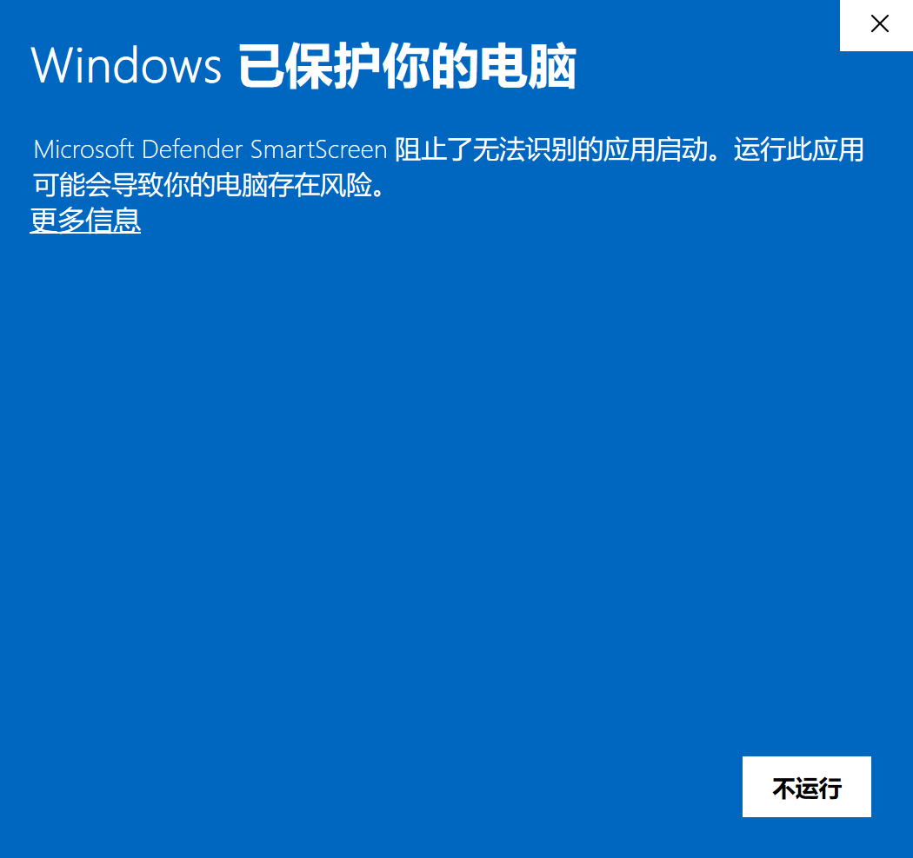

After that, you may see wanrings like "Do you want to allow public and private networks to access this app?", click "Allow"
<!-- Change it to an English version after -->
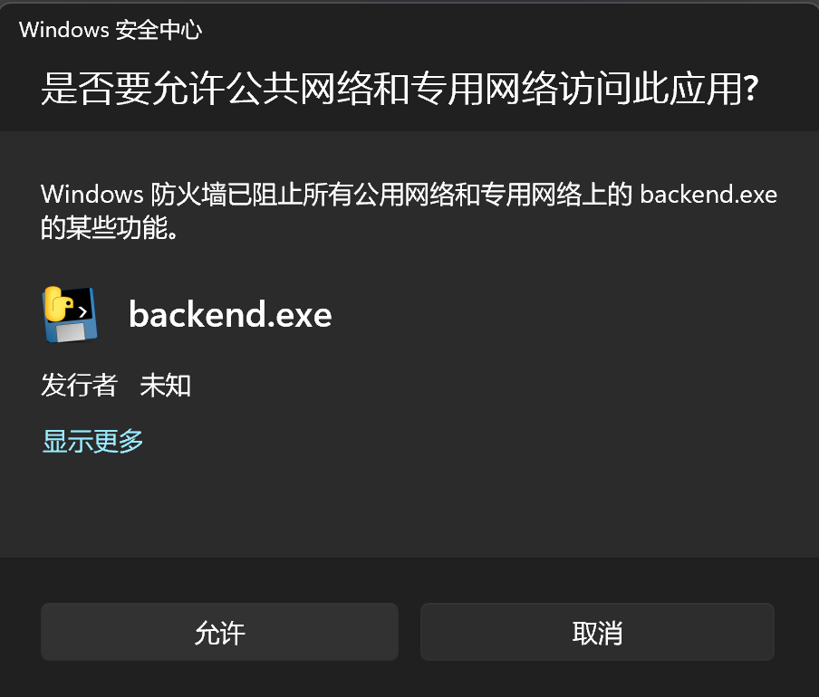

**If you are on MacOS, make sure to enable to the following Privacy & Security permissions:**

1. Disable Code Signature Check

After install .dmg file, use XCode to disable signature check:

```bash
$ sudo xattr -rd com.apple.quarantine /Applications/agentnet-annotator.app
```

2. Input Monitoring (for reading keyboard inputs)

When you open the app, a window should pop up prompting you to enable Input Monitor permissions.

<div flex='row'>
    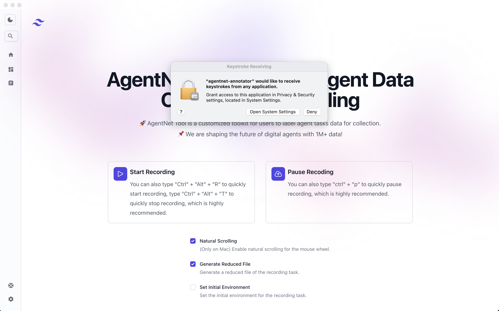
    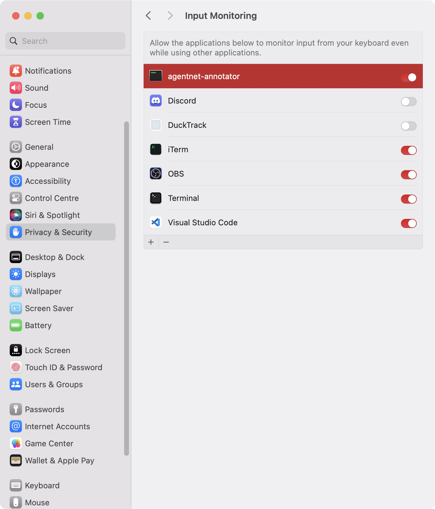
</div>

You should check the permissions for agentnet-annotator in the system settings.

## Running the App

### Recording

From the app tray or GUI, you can start and stop a recording as well as pause and resume a recording. Pausing and resuming is important for when you want to hide sensitive information like credit card of login credentials. You can optionally name your recording and give it a description upon stopping a recording. You can also view your recordings by clicking them in the sidebar.

### HTML/DOM Tree Capture

If you wish to capture HTML in your workflow while recording, make sure to use [Google Chrome Dev](https://developer.chrome.com/) to load our yet-to-be-released browser plugin. For installation and usage of the browser plugin, please refer to [AgentNet-Chrome-Plugin: Add Chrome Support for AgentNet (github.com)](https://github.com/fyq5166/AgentNet-Chrome-Plugin)

## Annotation guideline

### Overview

These guidelines are designed to help annotators accurately identify and record key events necessary to complete a specific task with a clear and singular objective. The task should be of sufficient length, requiring no fewer than 15 events. Here, we'll clarify which tasks are suitable for annotation and which events within those tasks should be retained.

### Selection Criteria for Tasks

#### Appropriate Tasks
- **Single Objective:** The task must focus on **achieving one specific goal**.
- **Sufficient Length:** The task should involve **at least 15 necessary events** to ensure detailed process mapping.

### Identification of Key Events

#### Definition of Key Events
- **Key events** are those essential for the successful completion of the task.
- **Test of Key Events:** If removing an event results in the inability to replicate the task under the same initial conditions, then it is a key event.
- **Diversity**: The tasks annotated by a user **should involve a certain degree of diversity**, rather than consisting of a series of homogeneous tasks

### Annotation Pipeline

The following steps outline the process from starting a task(how to apply for research opportunity in XLang lab through Prof Tao Yu's homepage) recording to finalizing the annotation:

#### 1. **Start Recording:** 
Initiate the recording of the task.
   - Example: Click "Start Recording" or use the shortcut "Ctrl+Shift+R".
   - Verify: Ensure a success message appears and the app window minimizes. After that, start our tasks.

<div>
    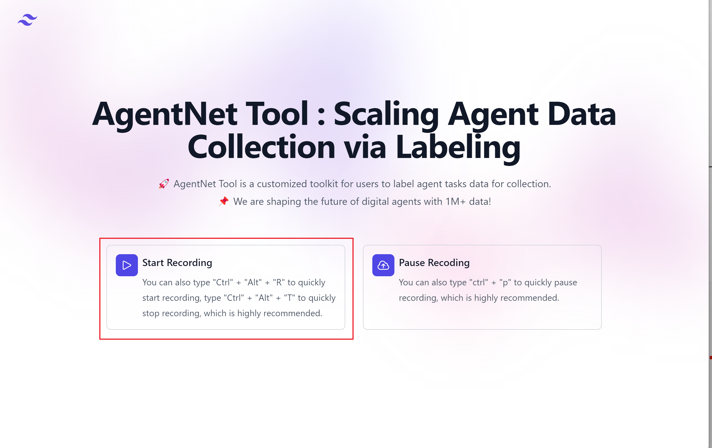
    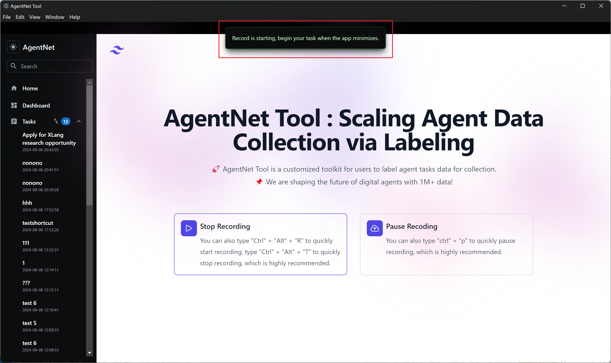
</div>

#### 2. **Perform the Task:** 
Complete the task according to its specific requirements.

#### 3. **Stop Recording:** 
Conclude the recording once the task is completed.
   - Example: Click "Stop Recording" or use the shortcut "Ctrl+Shift+T".
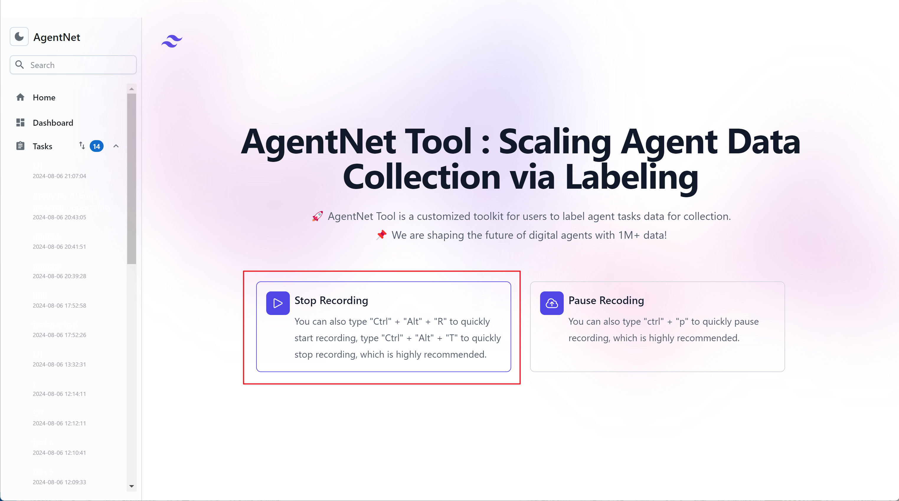

#### 4. **Naming and Describing the Task:**
   - Provide a simple description in the name field, such as "Apply for research opportunity."
   - Offer a detailed account in the description field, such as "Apply for research opportunity in XLang lab through Prof Tao Yu's homepage."
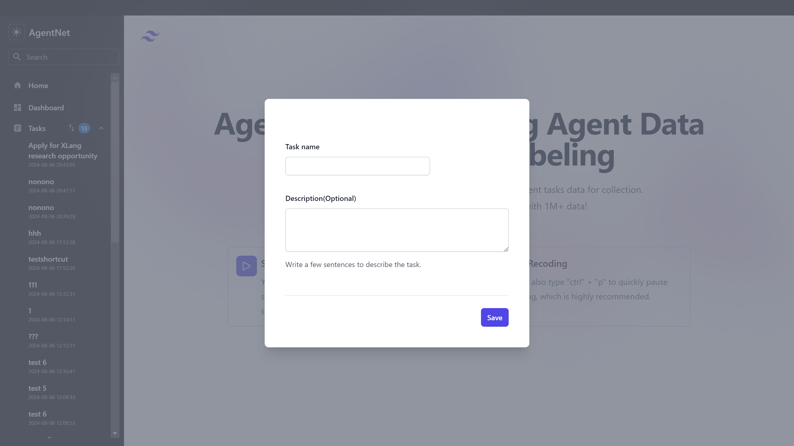

#### 5. **Review Recorded Events:** 
Access the task in the sidebar to review all recorded events.
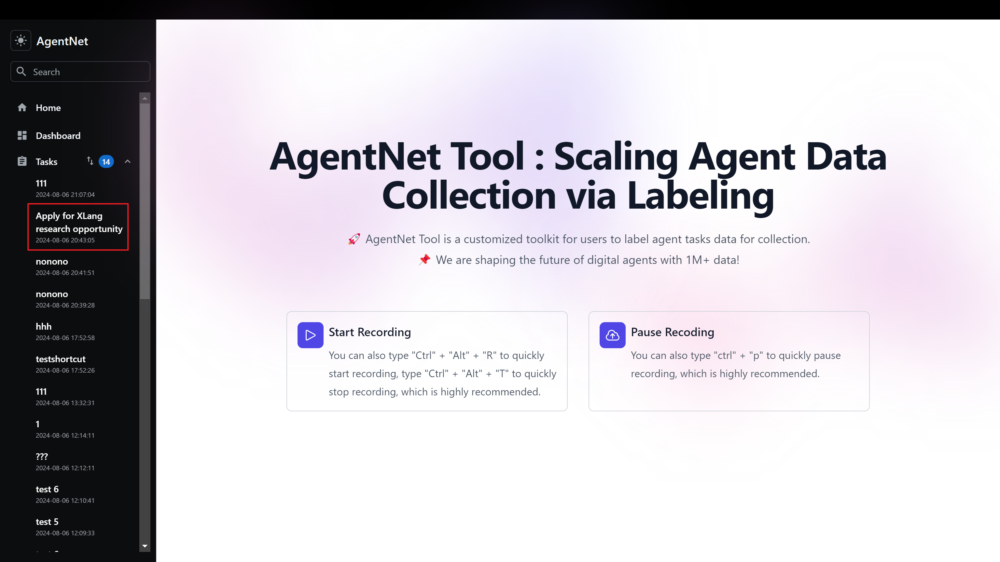
We can see that there are in total 22 events that were saved. Some of them isn't necessary so we won't keep them.
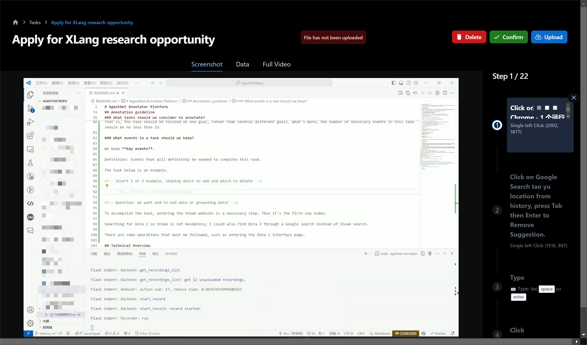


   - Keep: Retain key events necessary for task completion.
   - Delete: Remove events that are irrelevant or not essential to the task. 
   - Some examples about which task to keep and which to delete:
     - **Irrelevant Event:** Event 5, which has no actual meaning, should be deleted.
        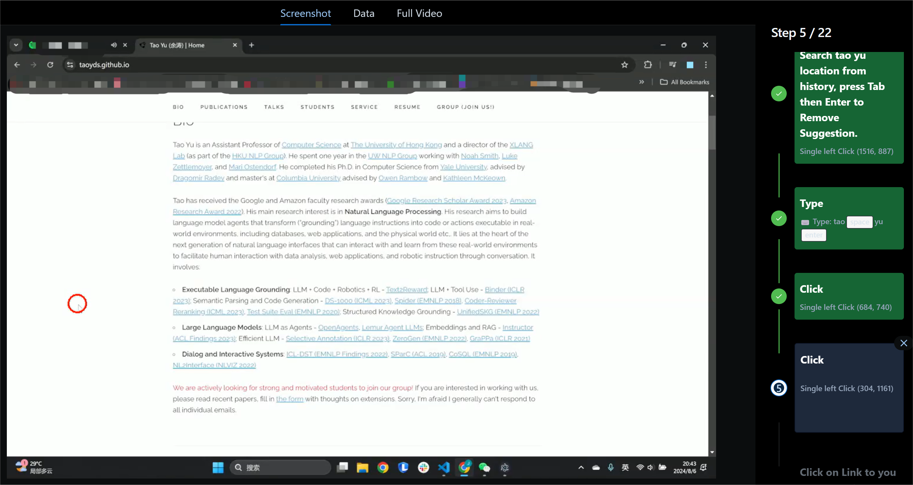

     - **Off-Task Events:** Events like 19, 20, and 21, which are not related to the task objective, should be removed.
        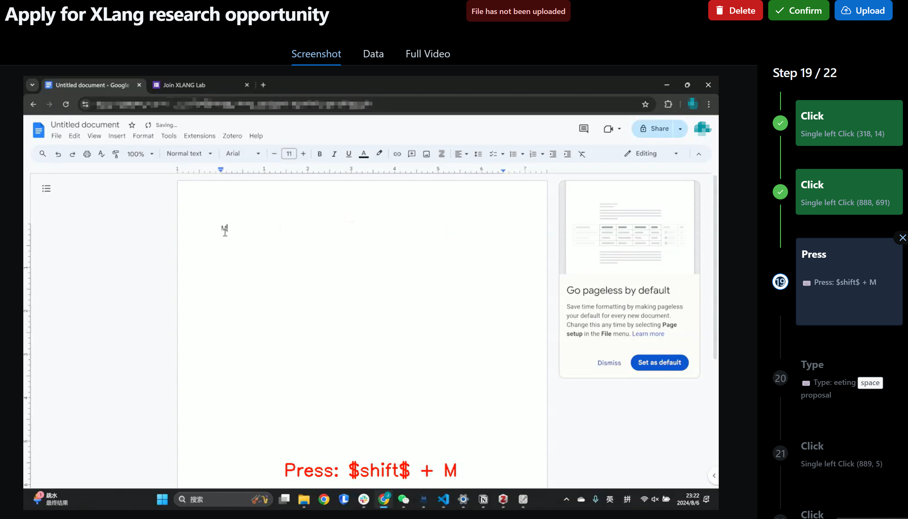
        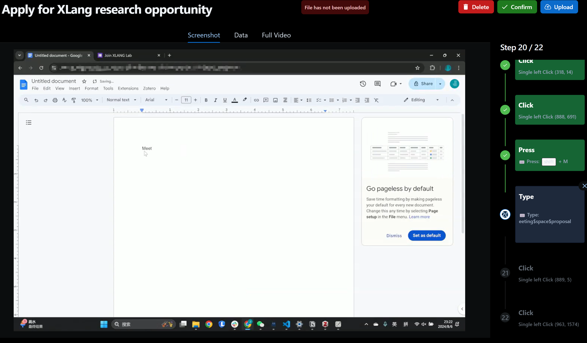
        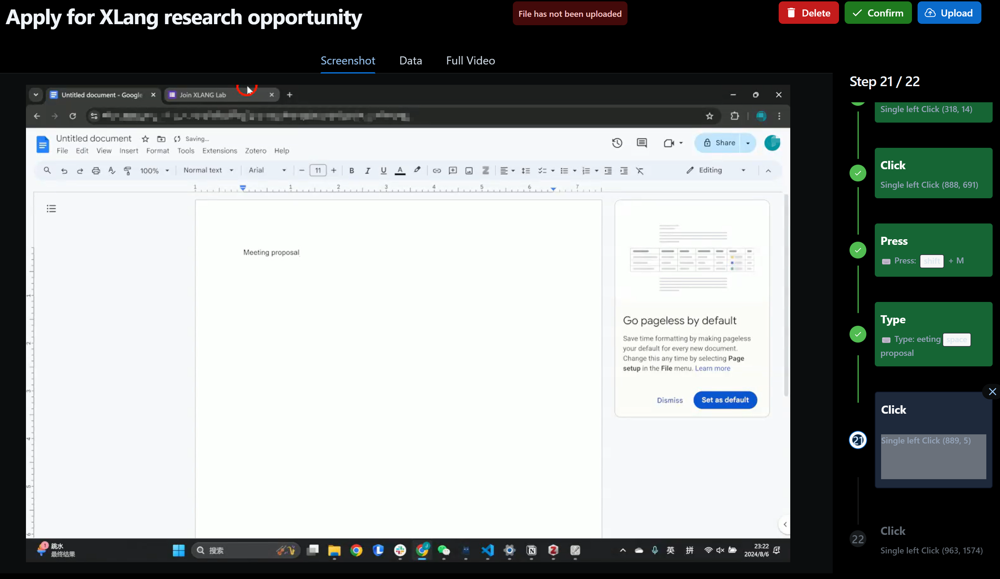

     - **Essential Events:** Events such as 3 and 7, which are crucial for task completion, must be retained.
        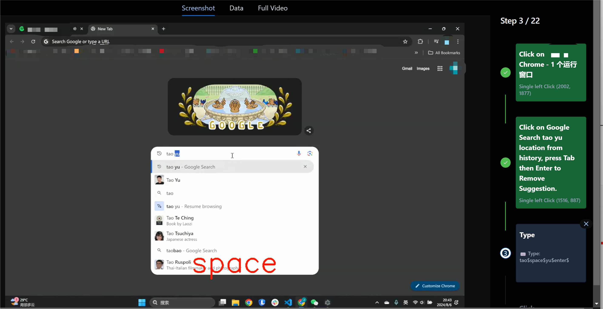
        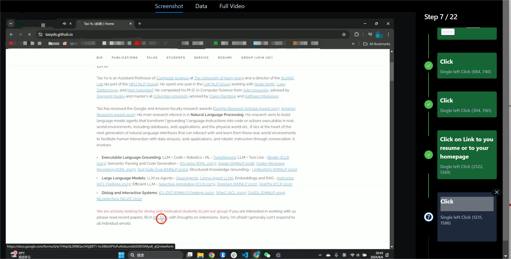


#### 6. **Editing Event Details:** 
Modify event descriptions to accurately reflect their significance.
<div flex='row'>
    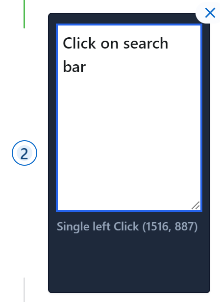
    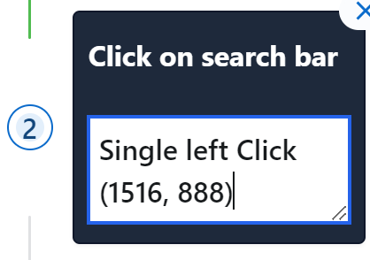
</div>

#### 7. **Confirm or Upload Annotations:**
   - **Confirm:** To save progress without finalizing, click the 'confirm' button.
   - **Upload:** To finalize and submit the annotation, click the 'upload' button. **Please upload the task data once it is completely processed**

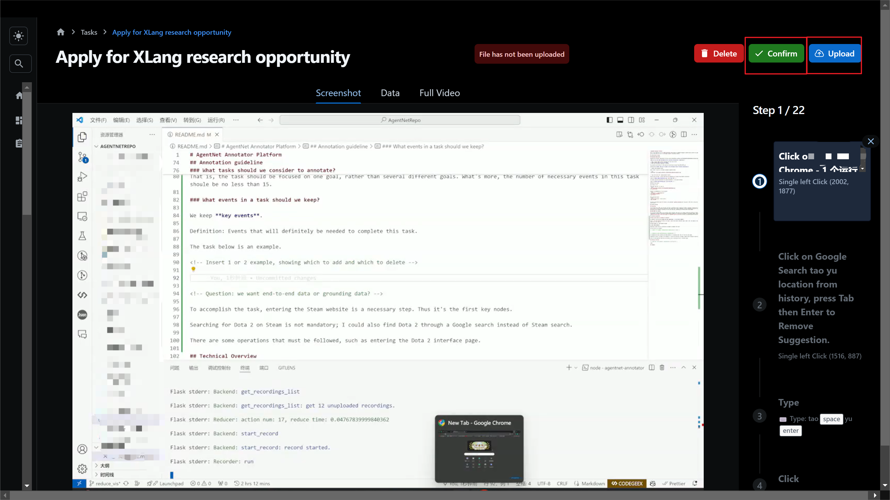

<!-- Question: we want end-to-end data or grounding data? -->

## Technical Overview

<!-- maybe put a nice graphical representation of the app here -->

*TBD*

## Feedback

We need you to fill out the issues you encountered during this annotation using the Feedback Template found in the folder at [AgentNet Feedback Folder](https://drive.google.com/drive/u/0/folders/1Bvc6rIO15QUJENhHVwESPQNGMeAjetcK). We expect you to **create a Google doc named after yourself** in this folder and fill it out according to the content of the Template. 

Moreover, If this recording is unable to upload in the app, **please zip the specific recording folder** (For example Documents/DuckTrack_Recordings/recording-20240806_130725) **and upload to** [**FailureCases**](https://drive.google.com/drive/folders/1_QsW9PnzJ_kPOWjLGPDsHy6vsOIQ5dze?usp=drive_link)**.**

For details on the Template, see [Feedback Template](https://docs.google.com/document/d/1piEu3TlJbIinXPTWvRLtn069O5jlnBcNZ9NVKl4bc4s/edit#heading=h.cny2k6ltmkb3). 

For an example, see [Feedback Example](https://docs.google.com/document/d/1V7t92jEud1dhyTPXzBxdLogeMfjnlrJ1rC1UeDstTZM/edit#heading=h.73jglcfdrtef).

## Build from source (Optional)

Have Python >=3.11.

Clone this repo and `cd` into it:
```bash
$ git clone https://github.com/XinyuanWangCS/AgentNetRepo.git
$ cd AgentNetRepo
```

Install the dependencies for this project:
```bash
$ pip install -r requirements.txt
$ cd agentnet-annotator
$ npm install
```

Build the application:
```bash
$ npm run build-flask  # build backend
$ npm run make
```

The built application should be located in the generated `agentnet-annotator/out` directory. After this, follow the remaining relevant setup instructions.
